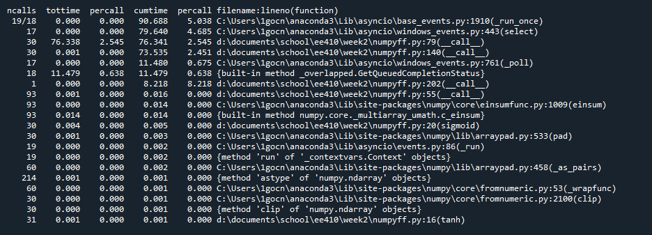

# ParallelWaveGAN Hardware Accelerator #

This directory contains work done both through weekly codefests, and in general, on the final project for ECE 410. The work for this project was done in collaboration with Google's Gemini LLM, and the full conversation for works done within can be found [here](https://g.co/gemini/share/235e15774d0e).

## Motivation ##
Though audio generation has made leaps in progress in recent years, recent developments tend to be focused on either software generation for music or hardware implementations that are focused on voice generation; there appears to be a large gap in hardware use of machine learning for musical purposes. As such, I was hoping to look for an audio generation algorithm that could be deployed on an FPGA module for use with Eurorack modular synthesizers. The ultimate goal is to create a self-contained Eurorack module that takes in inputs in the form of control voltage, and uses a machine learning algorithm to output audio samples that can be converted into output voltage.

## Algorithm Choice ##
Research began by looking through modern audio generation algorithms for a viable candidate that would fit our hardware needs; Gemini's "Deep Research" model was particularly helpful in this quest, and the associated conversation can be found [here](https://g.co/gemini/share/6be085720a74). The first algorithm we looked at is Google's Wavenet<sup>1</sup>, one the earliest approaches to ML audio generation. This algorithm served as the inspiration to many of the other algorithms we would eventually look at and features a Dilated Causal Convolutional Network to create the next sample based on a large window of previously generated samples along with a conditional input; as this algorithm was originally intended for voice synthesis, the conditional input is typically composed of text words for the network to convert into audio representations of these words. Dilated, in this context, refers to their technique for increasingly accessing samples that are wider apart as we move up through the network layers; this allows the netork to be influenced by a much larger window of samples and inputs without compromising computational efficiency. This algorithm was deemed unfit for our purposes due to the limitations on real-time performance imposed by its causal (sequential) nature; in order to precict the next sample, the network needs access to the sample immediately preceeding it. 

On the other end of the spectrum are current state-of the art models that rely on transformers in order to turn a description of a song into a full clip representative of the characteristics within that prompt; AudioCraft<sup>2</sup> by Meta is one such example. This is a powerful method, but lacks the direct control that we were seeking for our model; rather than creating entire tracks or songs, the goal was to create waveshapes or granular samples of sound to allow for more direct musical explorations.

The algorithm that we ended up settling on was name ParallelWaveGAN<sup>3</sup> (PWG). This algorithm is based off of the original WaveNet structure, but adds a few key improvements that are critical for our use case. Firstly, the parallel nature of this algorithm means that we are creating multiple samples every time-step, allowing us to achieve the real-time performance necessary for deployment as a hardware synthesis module. Secondly, the GAN design allows us to perform the more complicated training computations (discriminator) on a general purpose computer and deploy the simpler output network (generator) on our hardware. Given the timeline of this course project, only the generator network was focused on with the discriminator left for future work.

## Profiling ##
With our algorithm chosen, we can begin to analyze the portion of this algorithm that we can accelerate. To this end, we began by creating a naive Python implementation of the PWG generator network; code found within ```Week_2```. Without training data available yet, we tested this script by initalizing the weights randomly and verifying that the output sample was "believable" as an audio sample.

 

Once we confirmed that our naive model was performing as we expected, we could begin to profile the workload in the hopes of finding the biggest bottleneck. Firstly, we used ```cProfile``` to identify which of our function calls was taking up the most run-time. As expected, our ```conv_1D``` function was taking up the bulk or our calculation time; this makes sense as the ```conv_1D``` function is used for all of our hidden layers, whereas our other equally expensive convolution functions are only used a single time. 



We can further narrow down the most troublesum operations by using ```line_profiler``` within this function to confirm our suspicions regarding what specific line within this function is taking up the most time. As before, the results were expected and point to a nested loop of MAC operations that are both individually costly and repeated a vast number of times for every feed-forward pass. 


## Design ##
Since the bottleneck was determined to be MAC operations, we can begin work on designing our hardware solution. MAC operations are a common bottleneck in many machine learning workloads, and there are many possible solutions to accelerate them on custom hardware; for our design we chose to address the problem by using an output-stationary systollic array to allow the multple MAC operations required for each layer in parallel. Systolic arrays are inspired by the structure of biological hearts, and feature an array of pipelined Processing Elements (PEs) where data pulses through the array and is processed as it moves through each PE; activation values can be fed from left to right, while weights can be fed in from top to bottom. Output-stationary refers to the fact that we are feeding in both of our inputs to the array (activations and weights) while each PE retains the completed MAC value until it is accessed after all data has been processed.


The software/hardware boundary did end up changing through the eventual rescoping of the project, but our original plan was to have the software feed the raw input activation and weight vectors to the hardware through PCIe; SPI was determined to be too limiting for the large bandwidth we would require for real-time performance.

## Implementation Journey ##

