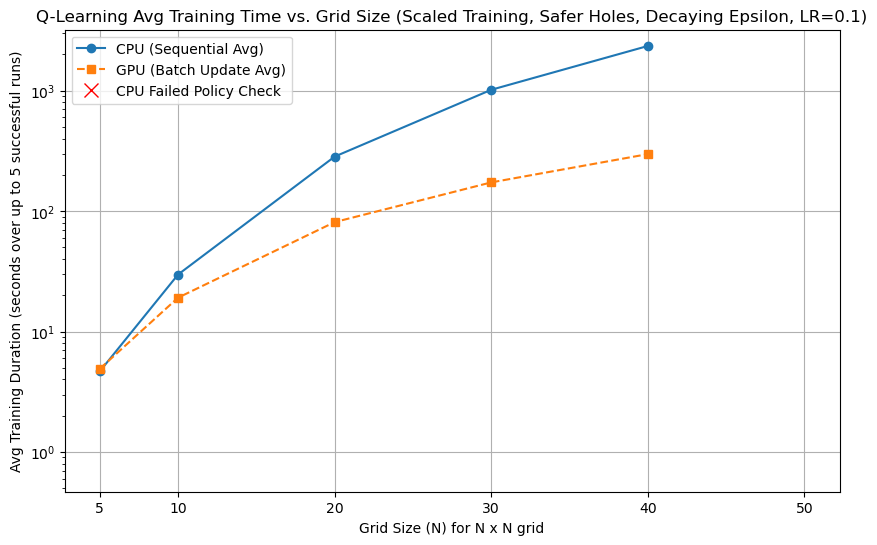

# Week 3 Challenges #

For Week 3, we were tasked with looking at a given Q-learning algorithm and considering possible hardware accelerations. As with Week 2 challenges, my intention is to learn to prompt Gemini better and get a feel for where "vibe coding" may be useful. As we'll see later, "vibe coding" seems to work better for me with pure software implementations, and less so when trying to create HDL modules.

Even before we started, I learned how to prompt Gemini a little more directly by splitting multi-part tasks into discrete instructions. Asking it to analyze the code from a GitHub link led to analyzing a hallucination, while asking it to copy the code first allowed me to verify the fetched code before beginning the analysis. Full conversation can be found [here](https://g.co/gemini/share/aa0070e34a40).

## Challenge 10 ##
For this challenge, we asked Gemini a few questions regarding the code and the results follow: 

### Analyze the code for bottlenecks ###
When asked to identify possible computational bottlenecks, Gemini suggested that the biggest likely bottleneck is the *repeated dictionary copy* where ```self.Q = self.new_Q.copy()``` is the most likely culprit. It did not identify the cost of MAC operations as a significant bottleneck, likely due to it considering those to be "required" costs in a purely software implementation; it later correctly identified these as areas of opportunity when designing a hardware implementation.

Given that it was only considering the code within the context of a general purpose CPU, I think that the suggestions make sense. Had I remembered to ask it about hardware before asking it to design the hardware, it surely would have identified the MAC operations as well. Overall, I'd say it did a good job at identifying bottlenecks that make sense within the context of the prompts I gave it.

### Hardware implementation ### 
As mentioned previously, when asked to design hardware specifically to address the possible bottlenecks in our algorithm, Gemini does a good job of including HW specific optimizations. Its core design methodology seemed to be focused on *eliminating copying* through in place memory and *increasing speed* through dedicated hardware logic for arithmetic, comparisons, writes, and reads. 

The resulting SystemVerilog module it provided seemed fairly well designed on first pass, but we quickly ran into problems when attempting to troubleshoot the module through a testbench that Gemini also provided. This is in line with my previous experience with Gemini's HW design capabilities; it can write SV code that seems good enough, but doesn't seem to be able to write testbenches that can verify its own design very well. More time and experiments will be able to tell us whether this is user error, a difference in our environment (QuestaSim) vs. Gemini's expected compilation and simulation environment, or possibly just a limitation of the LLM. 

Overall, I think it did a **decent** job designing the HW and creating the module, but I would definitely not trust it to verify its own design. If we have another hardware oriented challenge, and likely on the final project, I will design the testbench myself so as to ensure that the issues that are popping up are with the module and not with the testbench that it's providing.

## Challenge 11 ## 
For this challenge, we were tasked with optimizing the given code to run on a GPU.

### Optimization ### 
When prompted to optimize this specific algorithm for GPU use, Gemini correctly identified that this would likely be a slower implementation at the scale we were looking at; a 5x5 grid is more likely to perform better on a CPU regardless of any optimizations due to the overhead a GPU implementation would add. Nonetheless, we had it try and the first result led to an almost 40x runtime compared to the CPU. This was caused by the way that it was choosing to optimize the process, keeping the training mostly sequential while providing minimal calculation benefits. Results for CPU and GPU are named as such within the Challenge_11 directory.

### More appropriate comparisons ###
From there, however, I prompted Gemini to parallelize the workload for comparison with larger grid sizes that could better show the benefits of a GPU for this task (though not this specific board). After some troubleshooting, and back and forth, we settled on a design that included the following benefits: 

- Comparisons between GPU and CPU for identical seeds and grid size.
- Tests for multiple grid sizes, from 5x5 to 50x50, while maintaining the same relative hole probability (~16%)
- Multiple runs with these parameters to provide an average execution time
- Pre-tests for the board state to ensure that a WIN condition is possible
- Tuning the learning rate and reward values in order to ensure a WIN condition is met

The final code can be found within the Challenge_11 directory under Q_Compare.py, while the final results can be seen here (unfortunately, both agents failed at 50x50):



## Conclusion ##
Overall, I thought Gemini handled these tasks quite well. Again, we ran into issues with the testbench that it provided, but that's a fairly nuanced problem that I would feel more comfortable being handled by a human anyways; still seems fairly sketchy to have an AI testbench verify an AI designed module. It did well on the knowledge and reasoning portions, however, and still seems to be quite well suited to creating these python scripts much faster than I would've been able to on my own. I still believe that I'm providing the guidance required to create more meaningful comparisons, but the actual implementation was better than I would've been able to write within the same time frame. 

As far as the Q learning algorithm is concerned, we learned that there is not an appreciable benefit to GPU optimization for such a small board but that you get an order of magnitude improvement in execution time when the board is significantly larger.
