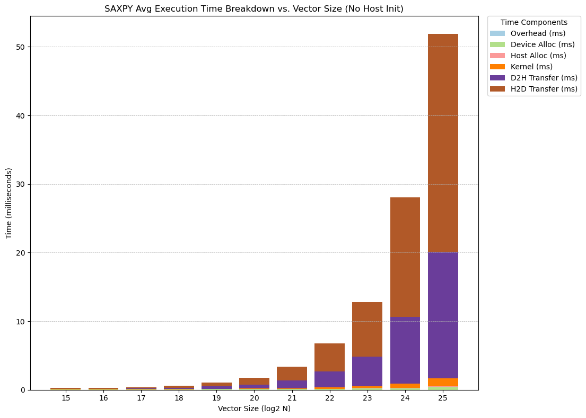
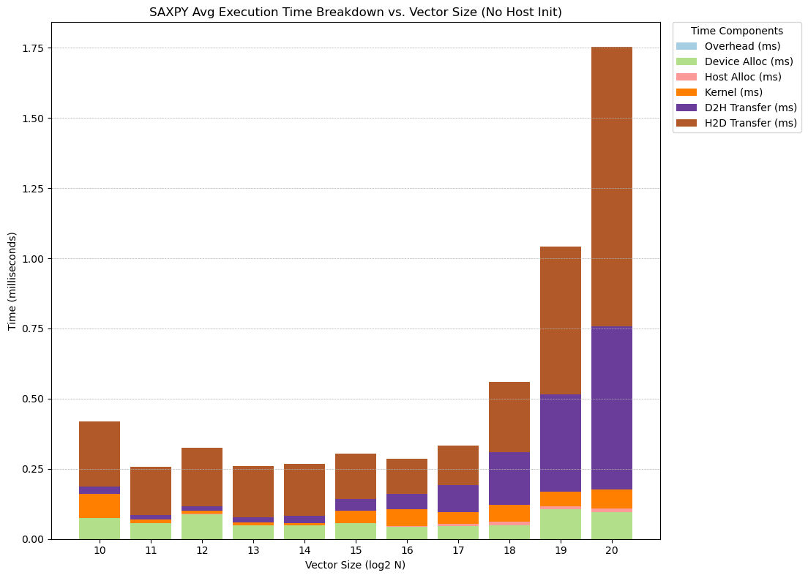
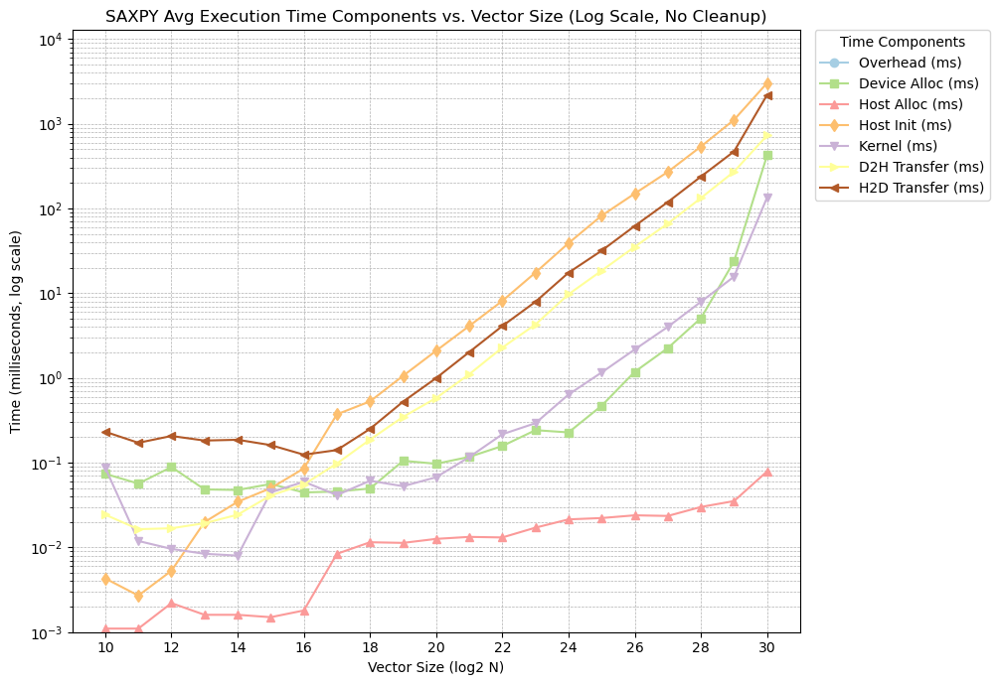
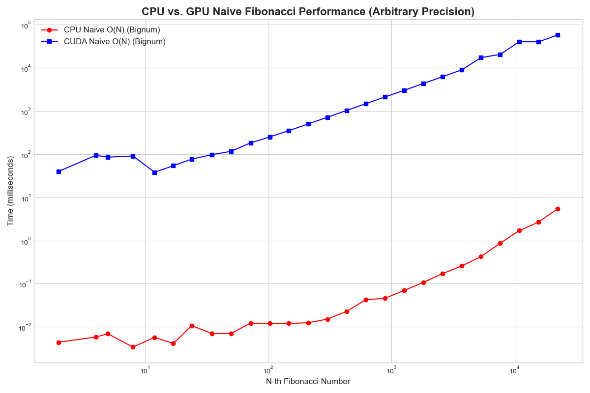
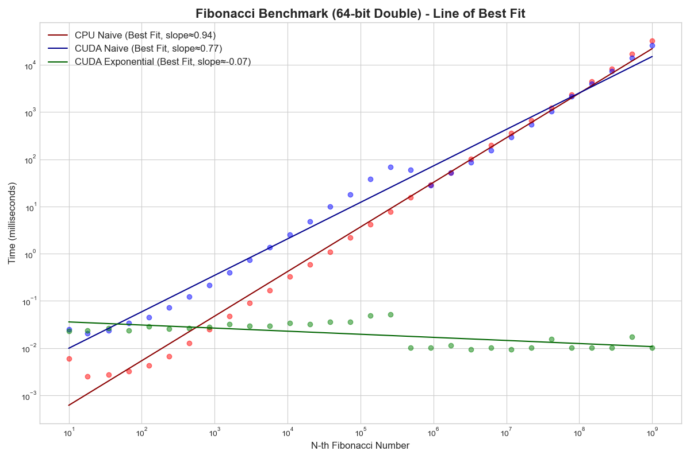

# Week 4 Challenges # 
For Week 4, the tasks were primarily focused on the strengths and limitations of CUDA implementations for machine learning and classical work loads. The Fibonacci sequence was our classical algorithm, while the SAXPY algorithm was our machine learning algorithm. My main goal was to gain experience with CUDA coding, but I did run into some interesting problems that I hadn't expected when starting these challenges.

A partial conversation can be found [here](https://g.co/gemini/share/1d97084f531a); for some unknown reason the part of the conversation related to SAXPY appears to be missing. While the final version of the code can be found within the directories of the same name.

## Challenge 13 ##
The SAXPY algorithm is a prime candidate for CUDA implementation thanks to it's high parallelizability; since CUDA can handle large vectors, limited only by our hardware, we can perform multiple instances of the basic operations performed on each individual element of the vector. Our missing piece of the Gemini conversation means a lot of the iteration is missing from the log but we had a rough sequence that looked as follows:
1. Prompting Gemini for installation instructions for CUDA on Windows 10.
2. Starting with a generated naive implementation of the SAXPY algorithm, followed by a parallizable one using CUDA kernels.
3. Adding the benchmarking code, saving the time taken for each part of the computation; memory transfer, calculation time, initialization, etc.
4. Plotting the results; this led to some need to balance the axis ranges and scaling to accurately show all of our results, meaning two charts were ultimately needed.

Middle range results of our SAXPY benchmarking:

Isolated lower half to improve visualization of small values with low vector sizes:

In addition to our bar graphs showing the overall time taken with each vector size, I also opted to create a line chart comparing each individual component's time taken as we increase our vector size:

The results mostly matched my expectations, with both transfer times increasing exponentially while the kernel time increased at a slightly reduced rate. There was a surprise, however, when looking at our values for N<16; these results appear to be almost random, even though they're the result of averaging multiple runs. My best guess to explain this behavior is that below a vector size of 16, we are not 'filling' up our individual WARPs within our CUDA thread blocks. My understanding was that a Warp is comprised of 32 threads, but it's possible that the compiler is further optimizing my kernel such that each element in our vector runs on two threads; this would mean that under N=16, we are no longer filling up a full Warp and could explain the strangeness we're seeing in our charts. Alternatively, it's possible that at these lower N values, we're experiencing significant "noise" from any other processes that are running on the GPU; since the card is not a dedicated ML processor, it's also in charge of any graphics on my desktop computer, the scheduler penalty may be more obvious at lower values.

## Challenge 14 ## 
To be completely honest, I had originally skipped this challenge due to mistakingly believing that I had fully understood what the end goal was; suffice it to say, it was much more interesting than I'd initially thought. My initial impression of the challenge was that it was to mainly show that CUDA is ill-suited towards fundamentally sequential algorithms like calculating the Fibbonacci sequence; since we incur a penalty during memory transfer, being able to solve a single value doesn't particularly help us in terms of performance. 

Since I believed that the naive implementations were straightforward, I instead opted for trying the "Fast Doubling" algorithm for calculating individual Fibonacci numbers; the "Fast Doubling" algorithm relies on matrix exponentiation, and is therefore a better candidate for parallelization so long as the goal is only to calculate an individual F(N) and not the full sequence. The naive approaches could be handwaved as being roughly equal N*F(2)_Calculation_Time since the time for the next sequential value is simply another sum operation, while we would truly run the "Fast Doubling" algorithm for benchmarking. We quickly ran into some strange results, however:

Our results match our expectations for a while, the naive CUDA algorithm is beaten by the naive CPU algorithm which is, in turn, beaten by the exponential algorithm. However, we see odd behavior starting around N=~105.5, where our CPU and CUDA naive implementations suddenly appear to match, and our exponential algorithm randomly drops down. Through analysis and further iteration, I believe that this was caused by our limited memory and the bounds of our chosen datatypes. While experimenting, I quickly found that I was unable to calculate beyond F(~50) with 32 integers, and the transition into 64-bit float values was leading the values to overflow to infinity; once the value was infinity, the benchmark lost all validity, and we begin to see those odd results.

I did try implementing an arbitrary bit-width implementation of all of our algorithms, the chart we saw previously, but ran into issues with running the exponentiation algorithm using this datatype.

# Conclusion #
For better or worse, the main takeaway I had for this week's challenges was to never underestimate a problem. I had totally overlooked Challenge 14 as being too easy to focus on, choosing to work on problems that were more immediately appealing, but the strange behavior we encountered led to it being one of the only challenges that I could not complete in the way that I'd hoped. This also showed me that I had not fully understood the problem, as I should've been able to predict that the value F(1020) was going to present massive memory and datatype challenges. In conclusion, after struggling with these issues I left this week quite humbled, and will pay better attention to future problems that may seem straightforward at face value.
