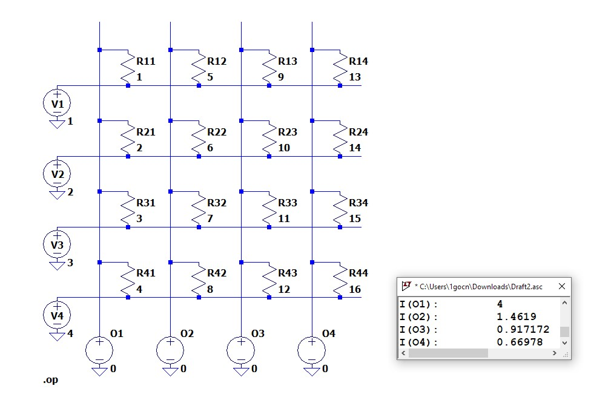
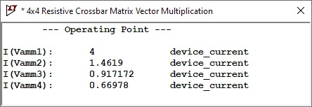

# Week 6 Challenges # 
For Week 6, we were asked to re-visit the binary LiF neuron as well as create a SPICE implementation of a resistive crossbar used for matrix-vector multiplication.

The full conversation can be found [here](https://g.co/gemini/share/2ada4d9309fb). While the final version of the code can be found within the Challenge directory of the same name.

## Challenge 19 ## 
This challenge appeared to be identical to my efforts in Week 1 - Challenge 4, which made me realize that I likely didn't have to attempt to create a testbench for that early challenge. As such, I made a mental note to revisit Challenge 19 if I had extra time at the end of the term; as of the time of submitting this blog, this did not end up happening. Previous work on my HDL LIF Neuron and associated testbench can be found in the ```Week_1``` directory.

## Challenge 20 ##
I had suspected that the relatively simple architecture of a resistive crossbar would get "one-shot" by Gemini, so I instead opted to create an implementation by myself using the LTSpice GUI. This was not too difficult, although going through the process of designing it by hand did lead me to consider a critical misunderstanding; I had not previously realized that the weights in a crossbar are typically transposed until I was reasoning through the input-output pipeline. With that corrected, I completed and tested my crossbar array with the following results:



Our multiplication results were exactly what we expected them to be, which meant that I had succesfully completed the task. From there, I asked Gemini to complete the same task in order to compare approaches and results. Firstly, Gemini used SPICE code where I used a GUI, which to be expected since code is a "language" and the GUI is a human-centered design. Secondly, as I had predicted when starting this task, Gemini was able to complete this task in a single pass, with the only changes needed being those I had to make in order to match changes in my chose matrix values. 



# Conclusion #
Other than correcting my misunderstaing about how weights are stored in a crossbar array, my main takeaway from this week was honestly how straightforward SPICE code is relative to the GUI. My experience with SPICE has been undergraduate courses so far, and I had started using it before I had ever gotten profficient at coding; having since learned quite a bit, particularly SystemVerilog which SPICE has some structural similarities to, SPICE seems much more approachable and I will likely be coding my next SPICE model. 

More related to this course, I confirmed my expectations of Gemini's strength with straightforward tasks in well-documented languages. While my previous struggles in Challenge 4 were likely influenced by the specificity with which a testbench much match the model it's testing (limiting the available data for an LLM further than the proprietary nature of most HDL already does), Gemini likely has a large breadth of training data related to SPICE syntax and resistive crossbars. Simple tasks that would be tedious for humans, like connecting a large array of wires to resistors in a regular structure, are likely one of the best uses for LLMs in coding and in general.
