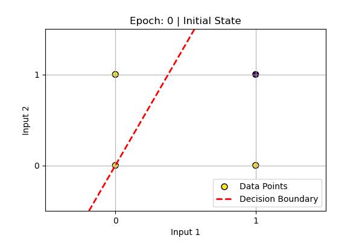
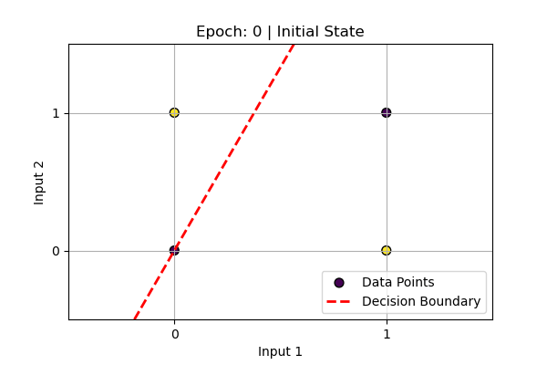
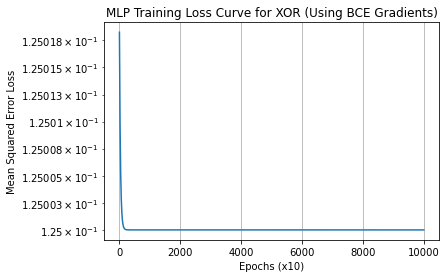
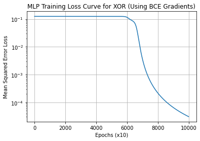
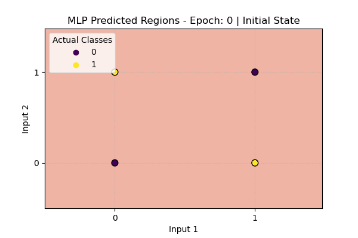
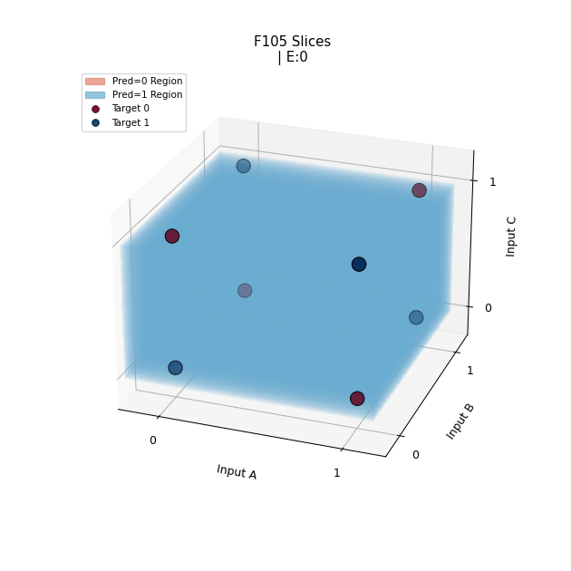

# Week 2 Challenges # 
For Week 2, we were tasked with exploring the use of perceptrons to solve binary functions. As I've had some experience with perceptrons before, my main intentions with these challenges was to play with "vibe coding", using Gemini 2.5, to create the code with only prompt guidance and minimal editing of the provided code.

The full conversation can be found [here](https://g.co/gemini/share/49894c7d5f92). While the final version of the code can be found within the directories of the same name.

## Challenge 6 ## 
Gemini handled Challenge 6 quite handedly, with the only concern being that I prompted it with a very open question; in the future, I would expect to receive better results right off the bat if I was more specific about what I was looking for (e.g. sigmoid activation function).

## Challenge 7 ##
With the perceptron implementation appearing correct for both NAND and XOR, we could then add the visualization of the decision plot through a GIF.

### NAND ###
NAND was fairly straightforward, as expected, and our resulting perceptron's evolution can be seen here:



### XOR ###
Knowing that a single perceptron is incapable, we expected XOR to not converge. Where I was surprised, however, is that the boundary did not appear to oscillate after a certain amount of epochs. This later turned out to be a result of taking GIF frames only after an epoch has updated weights for all inputs, so there was oscillation that was "unseen"; an issue that was succesfully diagnosed through talking with Gemini. XOR learning can be seen here:



## Challenge 8 ##
The final weekly challenge was to create a Multi-Layer Perceptron to solve the XOR problem. While there was a bit of trouble with picking the starting seed that led to some unnecessary troubleshooting of unrelated sections. Though Gemini did not directly diagnose the problem, it reacted well to being shown the Loss Curve showing that we were plateauing and not successfully converging. The two loss curves can be seen here:

 

Addressing this problem gives us the following prediction boundaries for our MLP:



## Extra ##
Additionally, I continued to experiment with getting Gemini to solve and present findings for a few more MLPs. Resulting GIFs can be found in ```./Extra```.

### Adder ###
Trivial in retrospect, since it's made of AND and XOR gates. This did however give the inspiration for the next experiment.

### All 1-output, 2-input, functions ###
Having solved for NAND, AND, and XOR, I got the idea to visualize the learning for all 16 possible functions. While the convergence was expected, this required giving our learning algorithm "momentum" to ensure that XOR and XNOR would converge within a reasonable time frame compared to the other functions. 

### 3-input XOR ###
With all 2-input functions solved, I was curious how we could tackle a 3-input XOR gate. This had similar problems with being seed dependent, but the bulk of the work was in being able to properly visualize the results in an intuitive way. Gemini suggested bout contour slices and voxels, and with some guidance, we ended up using a dense series of contour slices; a slight rotation to the graph also helps to better intuit the 3D nature of the learning process. This one was definitely my favorite result from the weekly challenges and can be seen here:



### 4-input XOR ###
I also played around with a 4-input XOR, but neither Gemini nor myself could think of an intuitive way to present a 4-dimensional boundary, with the added dimension of learning over time. Our resulting GIF looks only at the two 3D slices found at D=0, D=1, and is otherwise a repetition of the previous experiment.

# Conclusion #
Ultimately, I was quite impressed with how Gemini handled all the challenges that were presented. My experience with LLMs had been disappointing so far, as they do not tend to handle HDL well, but Gemini 2.5 seemed to do quite well in Python with these particular challenges. I believe that using Gemini helped me implement these challenges quite a bit faster than I would've been able to on my own. In particular, I appreciated how effortlessly it added the GIF export capability, as this would otherwise have been an 'extra' that may have distracted from the goal of getting succesfully converging perceptrons.

