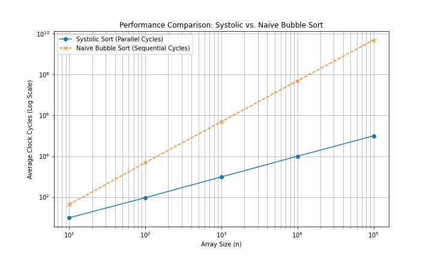
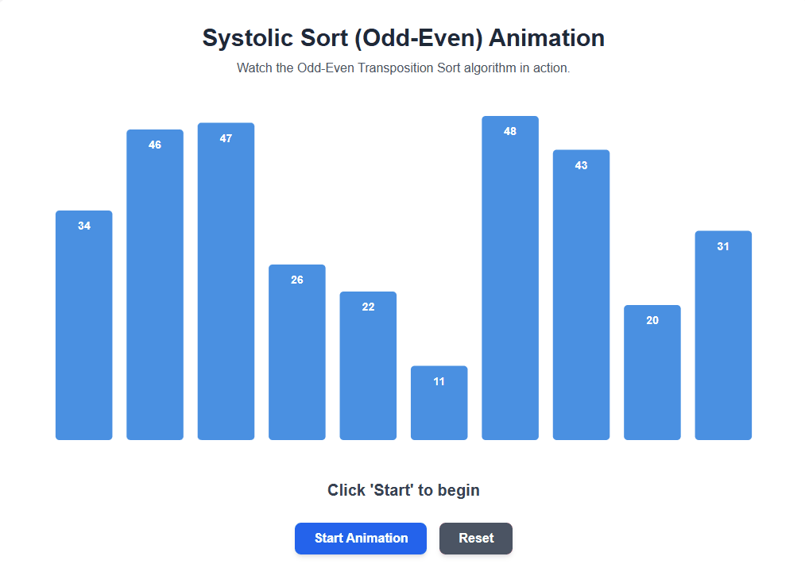

# Week 5 Challenges # 
For Week 5, we were tasked with benchmarking SAXPY performance on CUDA vs using an optimized library like PyTorch. Additionally, we were tasked with creating a systolic implementation of the Bubble sort algorithm. My primary goal with this week's challenges was to further explore the advantages of systolic architecture.

The full conversation can be found [here](https://g.co/gemini/share/6d74bdb18608). While the final version of the code can be found within the Challenge directory of the same name.

## Challenge 16 ## 
*Skipped for now*

## Challenge 17 ##
To be candid, I found the sytolic inspired parallelism we learned about in lecture to be one of the most fascinating takeaways from this course. As such, I was excited to get to try a different implementation from what I had been working on in my project. I began by having Gemini draft its interpretation of a systolic bubble sort, before discussing the possible ways that this could be accomplished. 

The typical bubble sort algorithm involves iterating through an array, comparing elements pairwise, and swapping them if they are not in the correct order, this is typically accomplished in O(N2) time. Gemini suggested a systolic implementation that relied on even and odd phases to perform N/2 pairwise swaps in the same cycle, or (N/2 - 1) depending on whether we have an element remaining; this hopes to complete the bubble sort algorithm in O(N) time at most. I had initially pictured a systolic implementation that more closely resembled the implementation for matrix multiplication, i.e. the array would be fed into the left, and each element would compare a stored value with the data that is "flowing" through to the right. Gemini corrected me, however, and we ended up agreeing that this would be a systolic implementation of the insertion-sort algorithm rather than bubble sort.

With that in mind, we took the bubble sort python script that Gemini had drafted, and refactored it with a focus on benchmarking speed in hypothetical cycles; since we were using python and not real hardware, this was a way for us to account for the massive parallelism that systolic architectures leverage. 

Our results very closely matched our expectations, with the naive implementation achieving ~O(N2) time and the systolic version achieving O(N) time; they both perform slightly better than worst-case, which is expected due to randomization of the array. 

With our benchmarking complete, I was still curious about the intuition behind the even-odd phase implementation and worked with Gemini to create an animation that would visually show our parallel sorting algorithm in action. After some wrestling with the LLM, we were able to get quite a nice visual representation of how our systolic implementation is able to save us so much time.

# Conclusion #
Outside of the project, Challenge 17 was the moment where I felt most in-control of Gemini as a coding collaboration tool. I had gotten better at the iterative prompting, and was more familiar with Gemini's strengths and weaknesses; it's great at "rubber-ducking" ideas and discussing general concepts, excels at quick scripts with incremental improvements to get to the more complete final outcome, but struggles heavily with "visualizing" the output and goal since it can't "see" or truly understand the "big picture". 

Additionally, I got to try another implementation of systolic architecture, and am sure to remember the benefits for future hardware projects. In my head, I already have an idea for trying out a 3D systolic architecture to implement 4x4 matrix operations since they are so common in computer graphics.
